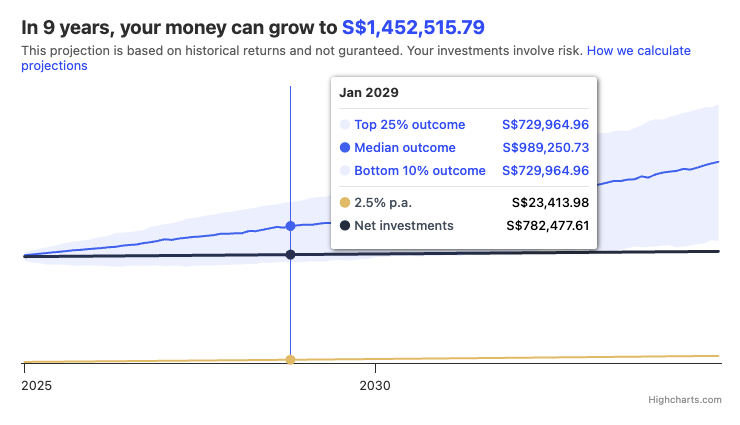

# Monte Carlo Simulation Graph

This project is built with React, Vite, and TypeScript. Hover over chart to view details.


Some libraries used in this project:
- [Highcharts](https://www.highcharts.com/docs/index): Plotting graphs 
- [Dayjs](https://day.js.org/): Formatting date strings
- [Tanstack query](https://tanstack.com/query/latest/docs/framework/react/overview): Fetching data from mock API

# How to run
```bash
npm install
npm run dev
```

